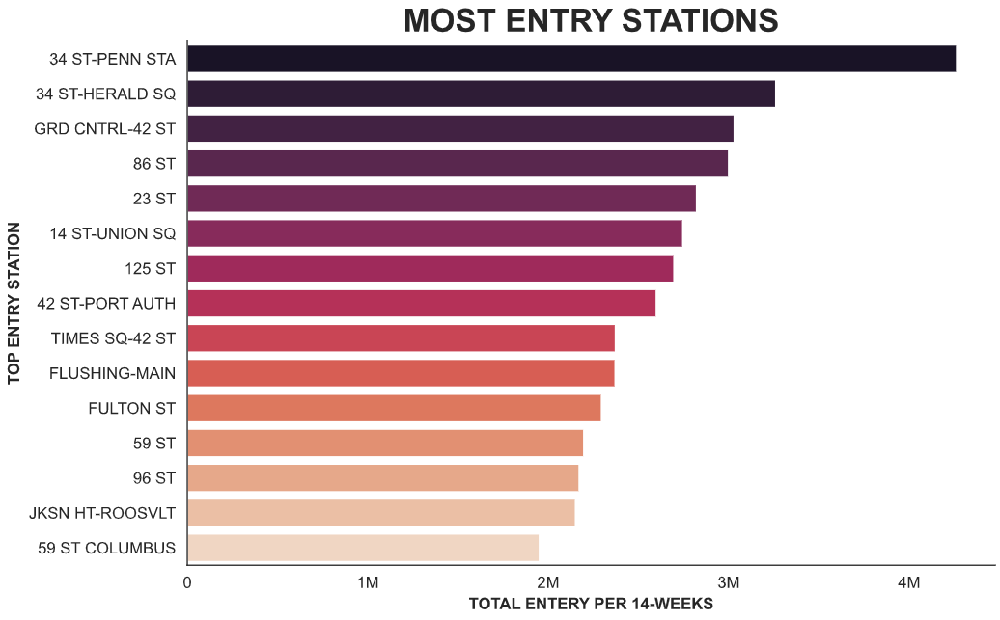
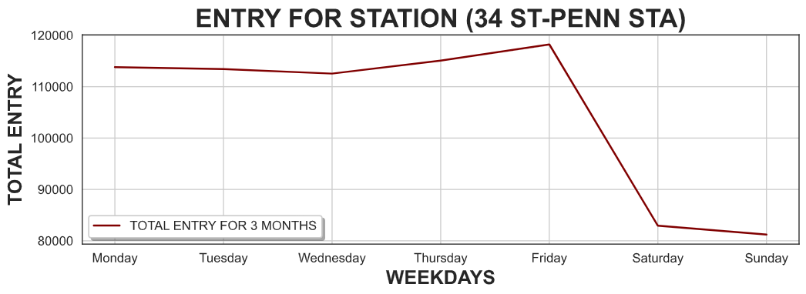

##  Blood Donation

The goal of this project is to find out the busiest station in New York City, to place a blood donation mobile health vehicle near the crowded stations and get blood donation from people

To reach this goal, I investigated the data available to me, and through this data and after analyzing it, I identified the 15 busiest stations in total during a period of 3 months as shown in the graph above.	

And through the graph shown above, we got to know the 15 most crowded stations, as shown in the y axis, the names of the busiest stations.

While searching in the data set, I also got to know the station (34 ST-PENN STA) with the busiest days, as shown in a total of 3 months as well, as shown in the graph above.
